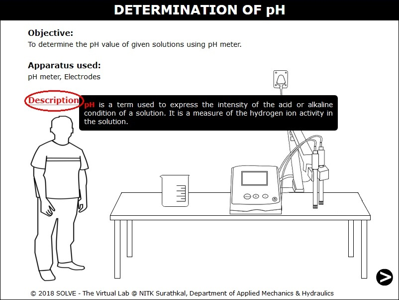
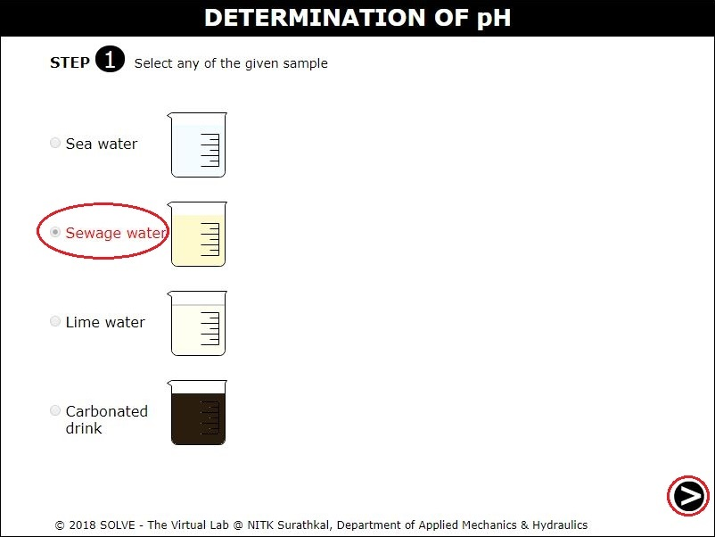
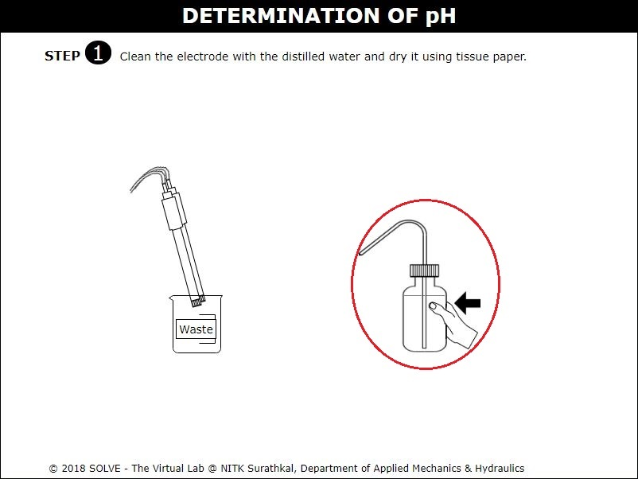
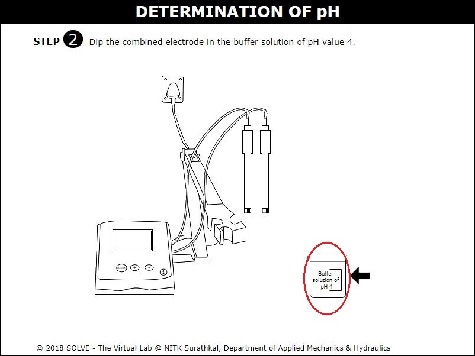
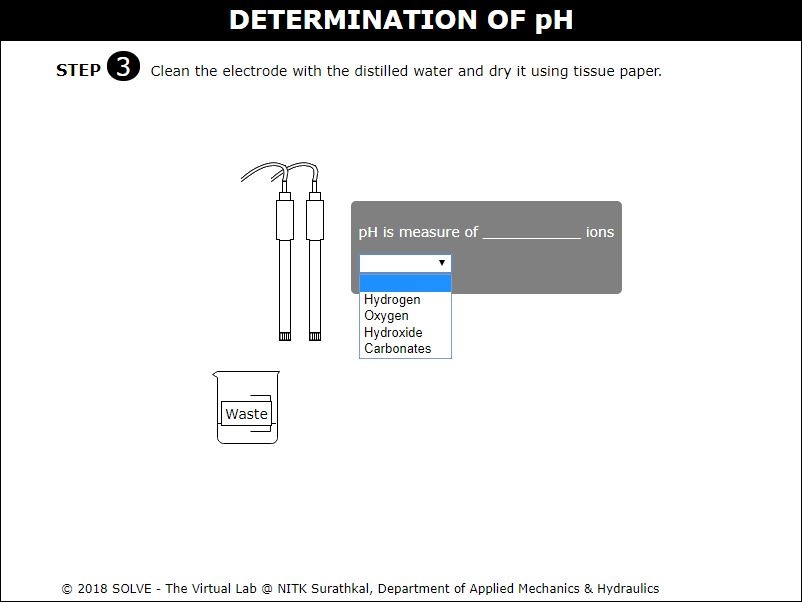
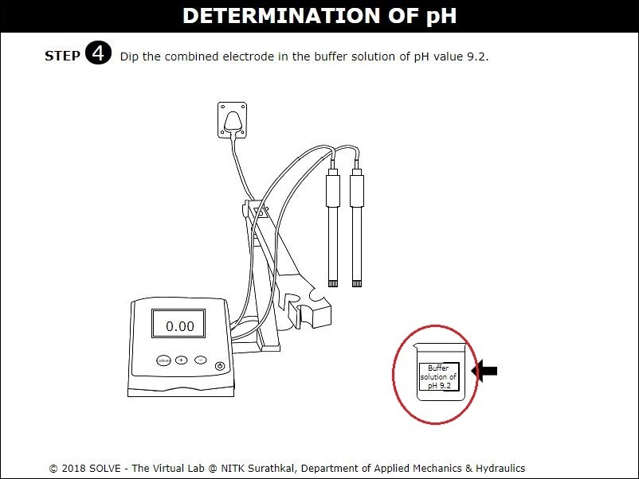
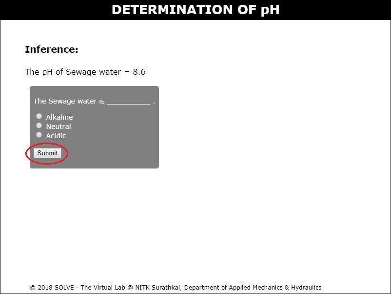

#### These procedure steps will be followed on the simulator

1. A new window will open as shown below, go through the description and click on NEXT button at the bottom right corner to move to the next step.  
 

2. Click here to select the sample to be tested and then click on NEXT button to proceed.  
 

3. Click on distilled water to clean the electrode, then click OK to the comment box and then proceed to next step. 
 

4. Click on buffer solution and then click on ON button to switch on the pH meter. Now click on electrode to dip it in buffer solution. 
 

5. Again click on distilled water to clean the electrode and select answer to the question displayed, then click on NEXT button to proceed. 
 

6. Now follow the same procedure for selected sample.  
 

7. Select answer to the given question. 
 
